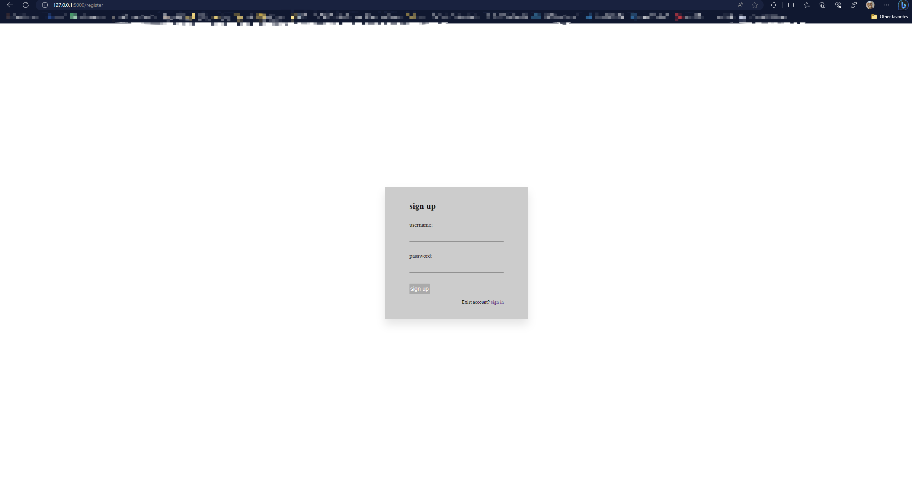
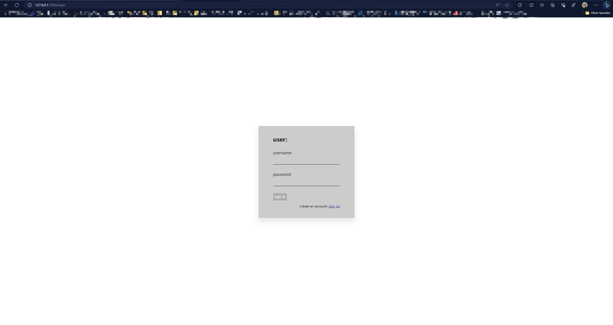
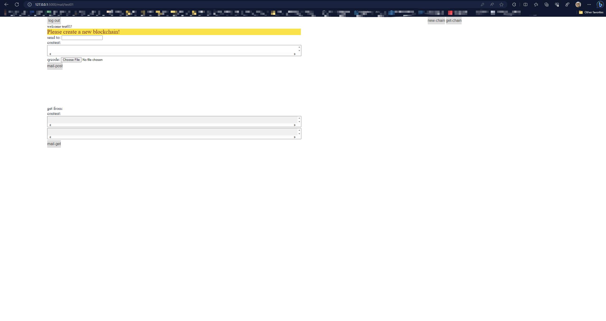

# Blockchain Postal System

The postal system is a popular medium to transfer items and documents between people and organizations. A lot of people remain involved in it as well as huge monetary and resource transactions happen through it. So, security and reliability are the crucial factors in this system. Blockchain is a robust, decentralize, and distributed security technique used mainly for secure transactions between different parties. So, in this project, our target will be to build a blockchain-based secure, and reliable framework for the postal system.

---

## environment

anaconda python env

```shell
conda create -n blockchain python=3.8
conda activate blockchain
pip install -r requirements.txt
```

If the project cannot run, consider installing the following libraries:

```shell
conda install -c anaconda flask
conda install -c anaconda pathlib
conda install -c conda-forge pyzbar
conda install -c anaconda pillow
```

---

## structure

* blockchain.py -> Fundamental implementation of blockchain
* postalSystem -> Business implementation of the postal system
* blockchainNetwork.py -> Blockchain functionality testing
* test.png -> Used for testing QR code images
* blockchain.json -> Blockchain data stored in JSON
* user.json -> User data stored in JSON
* templates ->
  * index.html -> index page
  * login.html -> login page
  * mail.html -> business page
  * register.html -> register page

---

## test

### test blockchain

install postman or other http test tool, and run blockchainNetwork.py

get ```​http://localhost:5000/chain​``` show current blockchain

get ```http://localhost:5000/mine​```​  create a block

post ```​http://localhost:5000/transactions/new```​  create a transaction

### test system

Regarding the testing system, you can conduct tests by calling the interface or using the [Postman link](https://grey-escape-755580.postman.co/workspace/New-Team-Workspace~56630bce-fafd-4f99-b2cb-a919a2e785dc/collection/5239348-91f83fb7-9f45-4921-a3c8-da916bf07052?action=share&creator=5239348)
 I've provided. Within that link, I've included all the interfaces. You're free to test them based on your own approach or ideas.

---

## run

### run postalSystem.py

open ```​http://localhost:5000/``` in browser

current user password: test01 123 or test02 123






#### warning

* In the email page, when users send an email for the first time, they need to click on the 'new-chain' button on the right, and the QR code is a required parameter.
* Users can view all chain data related to them by clicking the 'get-chain' button.

---
